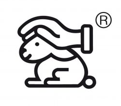

+++
title = "Reportage Tierversuche"
date = "2024-06-11"
draft = true
pinned = false
+++
## Tierversuche in der Kritik

**Tierversuche sind schon lange eine kontroverse Angelegenheit. Die Meinungen sind sehr unterschiedlich. Befürworter begründen Tierversuche mit wichtigen wissenschaftlichen und medizinischen Fortschritten, während Gegner vor allem die Haltung, den Schutz und den ethischen Aspekt bei Tierversuchen kritisieren.**

## Statistik

In der Schweiz wurden im letzten Jahrzehnt etwa 600'000 Tiere jährlich für Tierversuche verwendet. Leider sind dies nur die offiziellen Zahlen und die Dunkelziffer ist wohl noch erheblich höher, da viele unerlaubte oder ungenehmigte Tierversuche durchgeführt werden. Diese ist in anderen Ländern noch deutlich grösser, da es oft keine allzu strengen Regelungen gibt, was Tierversuche angeht. 

### 
Regelung

Bei Tierversuchen in der Schweiz müssen sich die Forschenden an das Tierschutzgesetz (TSchG) halten. Bei jeder Durchführung eines Tierversuchs muss zuerst ein Gesuch bei der kantonalen Behörde eingerreicht werden, bei dem eine Beschreibung und eine Begründung für den Versuch enthalten sein müssen. Wird dieses Gesuch genehmigt, kann der Versuch unter strenger Kontrolle durchgeführt werden, wobei viele Dinge beachtet werden müssen. Ausserdem muss immer am Ende des Monats oder des Jahres angegeben werden, wie viele Tierversuche durchgeführt wurden. So kann verhindert werden, dass zu viele oder auch ungewollte Tierversuche durchgeführt werden. 

###### 
In welchem Bereich werden Tierversuche durchgeführt?

Falls man erkennen will, ob ein bestimmtes Produkt mit Tierversuchen getestet wurde, muss man auf der Rückseite oder Unterseite eines Kosmetikproduktes nachschauen. Dort wird es entweder explizit erwähnt oder man sieht eines von vielen Logos, welches oft ein Hase ist.  

Tiere werden in der heutigen Zeit sehr oft im Bereich der Kosmetik verwendet, viele der täglich gekauften Produkte sind an Tieren getestet worden. Die Anzahl war früher natürlich deutlich höher als heute, aber es gibt trotzdem immer noch sehr viele Unternehmen wie zum Beispiel Nestlé, welche ihre Produkte an Tieren testen. In der Schweiz sind Produkte, welche mit Tierversuchen getestet wurden, verboten, man darf in der Schweiz keine Kosmetikprdukte an Tieren testen, jedoch 
sind nicht alle Kosmetikprodukte tierversuchsfrei, da in Europa und auch auf anderen Kontinenten Tierversuche für Kosmetikprodukte teilweise erlaubt sind. Viele Kosmetikprodukte werden auch in die Schweiz importiert, was bedeutet, dass es auch Produkte geben kann, welche an Tieren getestet wurden, da sie aus dem Ausland kommen.

### 
Schweregrade

Was ausserdem wichtig zu beachten ist, ist die Belastung für das Tier bei einem Versuch, denn nicht bei jedem Tierversuch wird das Tier so schwer belastet, dass es zu einem Tod oder zu langfristigen Schäden führt. Bei Tierversuchen differenziert man zwischen vier verschiedenen Schweregraden. Die meisten Tierversuche in der Schweiz gehören zum Schweregrad 0. Schweregrad 0 bedeutet, dass das Tier während des Versuchs fast gar nicht belastet wird. Bei Schweregrad 1 wird das Tier nur leicht belastet, ein Beispiel für den Schweregrad 1 wäre eine Blutentnahme. Schweregrad 2 wiederum belastet das Tier schon deutlich mehr. Kurzfristig erleidet das Tier eine mittelschwere Belastung, jedoch kann es vorkommen, dass das Tier auch über einen längeren Zeitraum danach eine leichte Belastung zu erleiden hat. Schweregrad 3 ist der am wenigsten durchgeführte Schweregrad, da das Tier hier eine schwere Belastung erleidet zum Beispiel mit einem chirurgischen Eingriff oder langfristig durch Versuche, bei denen dem Tier Krankheiten verabreicht werden, um zu sehen, wie sich die Krankheit entwickelt und wie das Tier darauf reagiert. Selten kann es auch vorkommen, dass das Tier durch den Versuch stirbt. Rund 
4.5% von allen Tierversuchen in der Schweiz gehören zum Schweregrad 3, was 27’000 Versuche ausmacht.

##### 
Haltung der Tiere

Was bei Tierversuchen eine wichtige Rolle spielt, ist die Haltung der Tiere, denn dieser wird häufig nicht sehr grosse Beachtung ge-schenkt, wobei man beachten muss, dass auch hier die schlimmsten Fälle von fehler-hafter Tierhaltung in zu kleinen Käfigen und Gehegen nicht genehmigte Tierversuche betrifft, bei denen häufig kein grosser Wert auf das Tierwohl gelegt wird.
Aber natürlich ist es nicht immer der Fall, dass Tiere, die für Tierversuche bestimmt sind, schlecht behandelt werden. Prof. Nadia Mercader beispielsweise forscht an der Universität Bern als Abteilungsleiterin im Bereich Entwicklungsbiologie und Regeneration und führt dort verschiedene Experimente, beispielsweise mit dem Zebrafisch durch. 

Sie hat uns bei einer kleinen Rundführung durch ihr Labor gezeigt, dass darauf geachtet wird, dass sich die Fische heimisch fühlen. Um dieses Gefühl bei den Fischen zu erzeugen, werden sie in Aquarien gehalten, die alle wie ein Flusssystem angeordnet sind. So läuft in einem Aquarium das Wasser aus dem Abfluss heraus und von einem anderen Aquarium wird neues Wasser in das Aquarium gepumpt. So entsteht für die normaler-weise im Ganges beheimateten Fische eine künstlich hergestellte Flussumgebung.
Ausserdem hat sie uns bei den Aquarien gezeigt, dass der Boden des Aquariums einen Flussboden simulieren soll und dass deshalb, wie es in einem Fluss üblich ist, Steine am Boden der Aquarien abgebildet sind. Ausser-dem schaut sie darauf, dass die Tiere sich möglichst in Gruppen in den Aquarien auf-halten, da die Zebrafische Schwarmtiere sind und sich so nicht einsam fühlen. 

#### 
Blick in die Zukunft

>
> «Möglicherweise werden in Zukunft weniger Tierversuche in der biomedizinischen Forschung durchgeführt»
> Dieses Zitat stammt von Prof. Mercader. Die mögliche Abnahme der Tierversuche in Zukunft begründet sie mit dem wissenschaft-lichen Fortschritt. Dieser sorgt dafür, dass man beispielsweise nicht mehr gleich viel von einer 

Probe benötigt, um etwas herauszufinden. Ausserdem wird sich die Forschung in Zukunft im Bereich der Tiere darauf konzentrieren, einen Ersatz für Tiere als Versuchs-objekte zu finden. Dabei konzentriert man sich an der Universität Bern momentan da-rauf, sogenannte Organoiden zu entwickeln. Dabei handelt es sich um menschliche Zel-len, welche man zu menschenähnlichen Mini-Gehirnen oder Lungen heranzüchten kann. Diese Organoide könnten nach einer voll-ständigen Entwicklung für Experimente be-nutzt werden und somit bräuchte man keine Tierversuche mehr, um beispielsweise Medi-kamente für Menschen zu testen. Jedoch sagt Prof. Mercader auch, dass die Forschung und Entwicklung der Organoiden erst ganz am Anfang sei und dass in der aktuellen Situ-ation Tierversuche unvermeidlich sind, da sonst der ganze wissenschaftliche Fortschritt, welcher über die ganzen Jahre erzielt wurde, mit einem Schlag verloren gehen würde und man wieder von ganz vorne beginnen müsste.

#### 
Der Verlust des wissenschaftlichen Fortschritts

In Bezug auf den wissenschaftlichen Fort-schritt und den damit verbundenen medizini-schen Fortschritt sind heutzutage Tierversu-che wohl unvermeidlich, es muss aber unbe-dingt darauf geachtet werden, dass Tierver-suche unter den bestmöglichen Vorausset-zungen durchgeführt werden. Diese Meinung teilt auch Prof. Dr. Würbel: 

>
> «Ich bin nicht gegen Tierversuche. Ich bin allerdings nur für Tierversuche, die unter höchsten wissenschaftlichen und ethischen Standards durchgeführt werden» 

##### 
Das 3R Projekt

Er ist Mitarbeiter der Universität Bern und forscht an dieser im Fachgebiet Tierschutz. Er hat uns erzählt, dass er der Koordinator des Forschungsprogramms 3R ist, welches ein Prinzip zur Reduzierung von Tierversu-chen ist. Die 3 Rs stehen für: Replace, Re-duce und Refine, was auf Deutsch ersetzen, reduzieren und verbessern heisst. Im Jahr 2018 wurde das 3R Kompetenzzentrum Schweiz gegründet, mit einer Geschäftsstelle in Bern und einem Netzwerk von 3R verantwortlichen an den Hochschulen. 

Mit dem 3R Forschungsprogramm versucht man herauszufinden, wie die Anzahl Tierver-suche reduziert und die Tierversuche selbst weniger belastet werden. Prof. Dr. Würbel hat uns ausserdem erklärt, worauf 3R bei einem Tierversuch achtet.  Zuerst achtet man darauf, ob bei einem Versuch wirklich Tiere für ein bestimmtes wissenschaftliches Ergeb-nis benötigt werden oder ob man dieses Er-gebnis auch mit anderen Mitteln erreichen kann. Ausserdem wird darauf geachtet, ob es wirklich so viele Tiere für ein Ergebnis braucht, da häufig für ein Ergebnis mehrere Tiere verwendet werden. Wichtig für das 3R Prinzip ist auch das Verbessern des generel-len Tierwohls. Dazu gehören die Haltung, die Fütterung und auch die allgemeinen Lebens-umstände der Tiere. 

### 
Was geschieht nach einem Versuch mit dem Tier?

Ein wichtiger Aspekt, wenn es um die kor-rekte Durchführung eines Tierversuchs geht, ist natürlich auch, was mit den Tieren nach den Versuchen geschieht, denn früher wurden so gut wie alle Tiere nach einem Versuch einfach getötet. Heutzutage gibt es immer noch viele Tiere, die nach einem Tierversuch getötet werden müssen, da sie genetisch ver-ändert sind oder auch ansteckende Krankhei-ten haben, weswegen sie nicht in die Umwelt entlassen werden dürfen. Jedoch gibt es immer wie häufiger sogenannte Rehoming-Projekte, mit welchen man Tiere an private Halter vermitteln kann und ihnen somit ein neues Leben ermöglichen kann. Ein Beispiel dafür ist die Universität Zürich, welche 2018 in Zusammenarbeit mit dem Schweizer Tierschutz STS ein solches Rehoming-Projekt auf die Beine gestellt hat. Mit Hilfe dieses Projekts konnten bis zum heutigen Tag schon viele Mäuse, Ratten, Kaninchen und Hunde an private Tierhalter vermittelt wer-den und somit wurde ihnen ein neues Leben möglich gemacht. Ausserdem hat die Univer-sität Zürich auch eine neue Möglichkeit für die forschenden Wissenschaftler geschaffen, mit welcher sie ihre Labortiere anonym über die Abteilung Tierwohl und 3R vermitteln lassen können. Jedoch wird verlangt, dass dies keine genetisch veränderten Tiere sind, da sonst eine Gefahr für eine Ansteckung oder mögliches bestände. 
Tiere, welche entweder nicht für Versuche geeignet sind oder nach einem Versuch unbrauchbar werden, werden teilweise mithilfe von CO2 getötet, indem man sie in Behälter mit CO2 einschliesst und den Behälter mit CO2 füllt, damit die Tiere ersticken. Diese Tötungsmethode ist eine der günstigsten Methoden und wird des-halb häufig verwendet. 

###### Tiere als Teil der Gesellschaft

Was immer mehr dazu beiträgt, dass Tier-versuche kritisiert werden, ist der Gesellschaftswandel, denn früher wurden Tiere eher als Dinge wahrgenommen und es spielte keine grosse Rolle, was mit den Tieren passierte, doch heutzutage werden Tiere immer mehr als Wesen angesehen und werden immer mehr ein Teil der Gesellschaft. Vielen Menschen ist es wichtig, dass Tiere gut behandelt werden, und daher werden Tierversuche immer weniger geduldet. 
Es ist sinnvoll, Tiere möglichst gleich zu behandeln wie Menschen. Bei Versuchen mit Menschen wird darauf geachtet, dass es dem Menschen möglichst gut geht und ihm nichts passieren kann. Warum sollte das bei Tieren also anders sein?